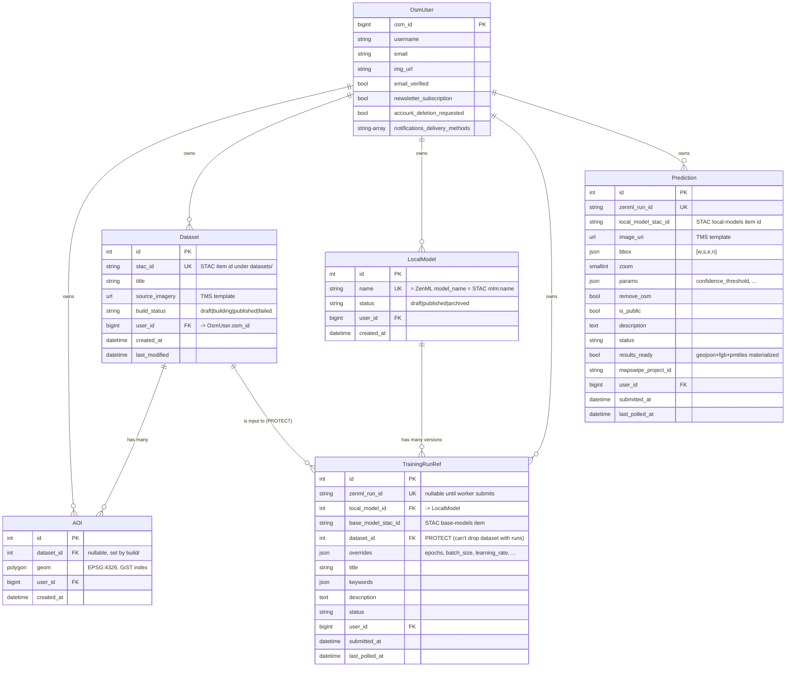

# fAIr Backend : Architecture

The fAIr backend is a Django REST Framework service that owns dataset, training, and prediction orchestration. It is a thin coordinator: it persists ownership and lifecycle in postgres, validates inputs, and delegates the heavy work : tile + label downloads, ML training, inference to async workers (django-tasks) and a ZenML server. Datasets, base models, and finetuned local models live in a STAC catalog; pipeline runs and step state live in ZenML; chips, weights, and prediction outputs live in S3-compatible object storage.

For the cluster topology, deployment manifests, and ops notes specific to the Kubernetes setup, see [`fAIr-models/infra/`](https://github.com/hotosm/fAIr-models/tree/main/infra).

---

## 1. End-to-end user flow

The user makes five calls. 

```mermaid
flowchart LR
    A[1. Draw AOI<br/>POST /aois/] --> B[2. Build dataset<br/>POST /datasets/build/]
    B --> C[3. Submit training<br/>POST /trainings/submit/]
    C --> D[4. Promote<br/>POST /trainings/&#123;id&#125;/publish/]
    D --> E[5. Predict<br/>POST /predictions/submit/<br/>GET /predictions/&#123;id&#125;/result/]
```



What happens behind each step:

| Step | What the backend does | Output |
| --- | --- | --- |
| **1. AOI** | Validates polygon, stores in postgres. | Row in `datasets_aoi`. |
| **2. Build dataset** | Async worker downloads OAM tiles + OSM labels for the AOI, uploads chips + `labels.geojson` to MinIO, registers a STAC item under `datasets/`. | Published STAC dataset. Poll `GET /datasets/{id}/` until `build_status=published`. |
| **3. Submit training** | Async worker submits a ZenML pipeline. ZenML schedules an orchestrator + step pods on the autoscaling ml pool (`split -> train -> eval -> onnx`). Worker polls ZenML status into the DB every 30s. | Trained `weights.pt` + `model.onnx` in MinIO. Poll `GET /trainings/{id}/` until `status=completed`. Tail with `GET /trainings/runs/{run_id}/logs/`. |
| **4. Promote** | API builds a versioned STAC `local-models/` item from the run's hyperparameters + asset URLs, validates against the base-model's `fair:hyperparameters_spec`, publishes. | `local_model_stac_id`. |
| **5. Predict** | Async worker downloads chips for the requested bbox, submits an inference pipeline, then post-processes the geojson into `.fgb` + `.pmtiles` via tippecanoe. | Three presigned URLs at `GET /predictions/{id}/result/` once `results_ready=true`. |

### Key invariants

- **Datasets, base-models, and local-models are STAC items.** The postgres tables (`datasets_dataset`, `modelregistry_localmodel`) are thin pointers that hold ownership + lifecycle state. Per-version metadata (assets, hyperparameter specs, mlm:training image, etc.) lives only in STAC.
- **Training and prediction are async.** The `POST /…/submit/` endpoints return 202 + a row whose `zenml_run_id` is null until the worker actually submits the pipeline. Status flow: `initializing -> submitted -> provisioning -> running -> completed | failed | …`.
- **`results_ready` on a Prediction is a separate flag from `status=completed`.** The worker's `post_run` step generates `.fgb` and `.pmtiles` from the geojson via tippecanoe *after* ZenML reports completion; until that finishes, `/predictions/{id}/result/` returns 409.
- **Publish is the only step that writes a versioned local-model STAC item.** It validates `mlm:hyperparameters` (logged by the training pipeline) against the base-model's `fair:hyperparameters_spec`. Any logged key not declared in the spec causes a 500 — the spec must stay in sync with the keys the training image actually emits.

---

## 2. Database schema

The Django backend owns one postgres database (`fair`). ZenML, MLflow, and the fair-models pipelines write to their own databases (`zenml`, `mlflow`, `fair_models`) on the same postgres instance.


---

## 3. API reference

All endpoints live under `/api/v1/` and require `Authorization: Bearer <token>`. The token is `FAIR_DEV_TOKEN` when `AUTH_PROVIDER=dev`, or a Hanko-issued JWT when `AUTH_PROVIDER=hanko`. Swagger UI: `/api/docs/`. OpenAPI: `/api/schema/`.

### Core flow

| Method | Path | Purpose |
| --- | --- | --- |
| GET | `/health/` | Liveness/readiness |
| POST | `/aois/` | Create an AOI polygon (GeoJSON Feature) |
| GET | `/aois/` | List AOIs (bbox-filterable) |
| POST | `/datasets/build/` | Enqueue a dataset build job. `aoi_ids`, `source_imagery` (TMS), `zoom`, `label_tasks`, `label_classes`, `keywords` (allowed: `building`, `road`, `tree`, `water`, `landuse`), `label_type`, `geometry_type` |
| GET | `/datasets/{id}/?expand=stac` | Inspect dataset, with STAC metadata + presigned `chips`/`labels` URLs once published |
| GET | `/local-models/` | List published local models (the *family*; STAC has per-version detail) |
| GET | `/local-models/{id}/runs/` | List ZenML pipeline runs that produced this model |
| POST | `/trainings/submit/` | Enqueue a finetune. `base_model_stac_id`, `dataset_stac_id`, `model_name`, `overrides` (must match base-model's `fair:hyperparameters_spec`) |
| GET | `/trainings/{id}/` | Run state including `zenml_run_id` |
| GET | `/trainings/runs/{run_id}/status/` | Force-poll ZenML; refreshes the DB row |
| GET | `/trainings/runs/{run_id}/logs/?tail=N&step=name` | Tail orchestrator or step logs |
| POST | `/trainings/runs/{run_id}/cancel/?graceful=true` | Stop a running pipeline |
| POST | `/trainings/{id}/publish/` | Promote a completed run to a versioned local-model. Validates against base-model spec; writes a new STAC item under `local-models/`. Returns `local_model_stac_id` |
| POST | `/predictions/submit/` | Enqueue inference. `model_stac_id`, `image_uri` (TMS), `bbox`, `zoom`, `params`, `remove_osm` |
| GET | `/predictions/{id}/` | Status + assets (presigned) once `results_ready=true` |
| GET | `/predictions/{id}/result/` | Just the three presigned URLs (geojson / fgb / pmtiles); 409 until `results_ready` |
| GET | `/predictions/runs/{run_id}/{status,logs}/` | Same shape as trainings |
| POST | `/predictions/{id}/{publish,unpublish}/` | Toggle `is_public` (anonymous read of result) |

### Schema endpoints

| Method | Path |
| --- | --- |
| GET | `/api/schema/` (raw OpenAPI) |
| GET | `/api/docs/` (Swagger UI) |
| GET | `/api/redoc/` (ReDoc) |

### User test 

Send these one at a time from Swagger (`/api/docs/`) or any HTTP client. Every request needs `Authorization: Bearer <FAIR_DEV_TOKEN>`. Substitute the IDs returned from each step into the next.

**1. Create the AOI** : `POST /api/v1/aois/`

```json
{
  "type": "Feature",
  "geometry": {
    "type": "Polygon",
    "coordinates": [[
      [85.51678, 27.63133], [85.52323, 27.63133],
      [85.52323, 27.63743], [85.51678, 27.63743],
      [85.51678, 27.63133]
    ]]
  },
  "properties": { "dataset": null }
}
```

Response carries `properties.id` -> call this `AOI_ID`.

**2. Build the dataset** : `POST /api/v1/datasets/build/`

```json
{
  "title": "smoke-banepa",
  "description": "e2e test",
  "source_imagery": "https://tiles.openaerialmap.org/62d85d11d8499800053796c1/0/62d85d11d8499800053796c2/{z}/{x}/{y}",
  "zoom": 19,
  "aoi_ids": [AOI_ID],
  "label_tasks": ["object-detection"],
  "label_classes": [{ "name": "building", "classes": ["*"] }],
  "keywords": ["building"],
  "label_type": "vector",
  "geometry_type": "polygon"
}
```

Response: `id` (-> `DATASET_ID`), `stac_id` (-> `STAC_ID`), `build_status: "building"`.

**3. Wait for the build** : `GET /api/v1/datasets/{DATASET_ID}/`

Poll until `build_status == "published"` (~2 min for this AOI).

**4. Submit the fine-tune** : `POST /api/v1/trainings/submit/`

```json
{
  "base_model_stac_id": "yolo11n-detection",
  "dataset_stac_id": "STAC_ID",
  "model_name": "yolo11n-detection-finetuned-banepa-smoke",
  "overrides": {
    "epochs": 3,
    "batch_size": 2,
    "learning_rate": 0.01,
    "chip_size": 640
  }
}
```

Response: `id` -> `TR_ID`. Poll `GET /api/v1/trainings/{TR_ID}/` until `status == "completed"` (~22 min, ml-pool autoscale + 4 pipeline steps). Tail logs anytime with `GET /api/v1/trainings/runs/{zenml_run_id}/logs/?tail=100`.

**5. Promote** — `POST /api/v1/trainings/{TR_ID}/publish/`

```json
{ "description": "smoke" }
```

Response: `local_model_stac_id` -> `LM_STAC_ID`. Inspect with `GET /api/v1/local-models/` and the STAC item at `https://stac.<domain>/stac/collections/local-models/items/{LM_STAC_ID}` to see `weights.pt`, `model.onnx`, training metrics.

**6. Submit the prediction** : `POST /api/v1/predictions/submit/`

```json
{
  "model_stac_id": "LM_STAC_ID",
  "image_uri": "https://tiles.openaerialmap.org/62d85d11d8499800053796c1/0/62d85d11d8499800053796c2/{z}/{x}/{y}",
  "bbox": [85.51678, 27.63133, 85.52323, 27.63743],
  "zoom": 19,
  "params": { "confidence_threshold": 0.25 }
}
```

Response: `id` -> `PRED_ID`. Poll `GET /api/v1/predictions/{PRED_ID}/` until `results_ready == true` (~10 min).

**7. Fetch the results** : `GET /api/v1/predictions/{PRED_ID}/result/`

Returns three presigned URLs (`geojson`, `fgb`, `pmtiles`). Open the geojson , expect ~150-200 building bounding-box polygons for this AOI.
