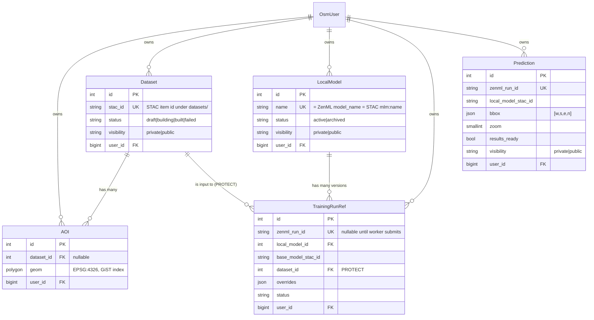

# Backend

The backend is a Django REST Framework service organized into feature apps. It owns one Postgres database (`fair`); ZenML, MLflow, and the model pipelines write to their own databases on the same instance.

## Apps

| App             | Responsibility                                                                                                                                                                           |
| --------------- | ---------------------------------------------------------------------------------------------------------------------------------------------------------------------------------------- |
| `accounts`      | Custom `OsmUser` keyed by `osm_id`. Supports a static dev token and Hanko SSO.                                                                                                           |
| `datasets`      | `Dataset` (a pointer to a STAC item) and `AOI` (a PostGIS polygon). Async build downloads imagery tiles and OSM labels, uploads chips and `labels.geojson`, and registers the STAC item. |
| `modelregistry` | `Category`, `BaseModel` (a pretrained model family), and `LocalModel` (a finetuned family). Endpoints for base models, local models, categories, and pinned models.                      |
| `trainings`     | `TrainingRunRef`, one row per finetune run, with the hyperparameter overrides and status. Submits ZenML pipelines and polls their state.                                                 |
| `predictions`   | `Prediction`, with the bbox, zoom, params, and a `results_ready` flag. Post-processes GeoJSON into `.fgb` and `.pmtiles`.                                                                |
| `feedback`      | User feedback on predictions and models.                                                                                                                                                 |
| `notifications` | Site-wide banners and per-user notifications, for example training status changes.                                                                                                       |
| `stars`         | Starring a model or dataset.                                                                                                                                                             |
| `workspace`     | A user's object-store workspace, listing and presigned URLs.                                                                                                                             |
| `system`        | Health and KPI endpoints.                                                                                                                                                                |
| `shared`        | Cross-cutting helpers: enums, exceptions, validators, storage, and the integrations layer.                                                                                               |
| `config`        | Django project settings, URL routing, and environment parsing.                                                                                                                           |

Enums live in `shared/enums.py` as Django `TextChoices` and are imported by the models, rather than redefined per app.

## The fair integration layer

The heavy ML work is handled by the external `fair` package (`fair-py-ops`), which wraps ZenML and STAC. The backend calls it through `shared/integrations/`:

- `integrations/zenml.py` wraps the fair client and run helpers. It builds a process-wide client for the worker and a user-scoped client for owner actions.
- `integrations/stac.py` wraps the STAC backend with a short-lived cache. Property changes are read-modify-write, since the STAC API has no PATCH. It also mirrors downloadable assets into the bucket and repoints their URLs at a presign proxy.
- `integrations/mapswipe.py` handles the MapSwipe validation flow.

## Database schema

The tables hold ownership and lifecycle state and point at STAC items; per-version metadata stays in STAC.

The complete field list and endpoint reference are in [`backend/ARCHITECTURE.md`](https://github.com/hotosm/fAIr/blob/develop/backend/ARCHITECTURE.md).
