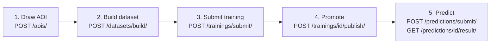

# Architecture

fAIr is a Django REST backend, a React single-page app, and an ML layer built on ZenML, a STAC catalog, MinIO, and MLflow. The backend is a thin coordinator: it persists ownership and lifecycle in Postgres, validates inputs, and delegates the heavy work (tile and label downloads, training, inference) to async workers and a ZenML server.

## Components

| Component                                | Role                                                                                                                                                         |
| ---------------------------------------- | ------------------------------------------------------------------------------------------------------------------------------------------------------------ |
| **Backend** (Django REST)                | Owns dataset, training, and prediction orchestration. Persists ownership and status in Postgres, submits pipelines, polls status. See [Backend](backend.md). |
| **Frontend** (React SPA)                 | The web app mappers use to browse models, run predictions, and manage training. See [Frontend](frontend.md).                                                 |
| **STAC catalog** (pgSTAC + stac-fastapi) | Source of truth for datasets, base models, and local models, including assets and metadata.                                                                  |
| **MinIO** (S3-compatible)                | Artifact store for chips, labels, weights, ONNX models, and prediction outputs.                                                                              |
| **MLflow**                               | Experiment tracking for training runs.                                                                                                                       |
| **ZenML**                                | Orchestrates the training and inference pipelines and tracks run state.                                                                                      |
| **Knative**                              | Serves one digest-pinned inference service per base model, with separate staging and live routes.                                                            |

The ML pipeline and how these services fit together are described in [ML pipeline](ml-pipeline.md).

## End-to-end flow

A full run is five stages: draw an area of interest, build a dataset, train, promote the result, and predict.

## Key invariants

- **Datasets, base models, and local models are STAC items.** The Postgres tables are thin pointers that hold ownership and lifecycle state. Per-version metadata (assets, hyperparameter specs, training image) lives only in STAC.
- **Training and prediction are async.** The `POST /.../submit/` endpoints return `202` plus a row whose `zenml_run_id` is null until the worker submits the pipeline.
- **`results_ready` is separate from `status`.** A prediction's outputs (`.fgb` and `.pmtiles`) are materialized by a post-run step after ZenML reports completion. Until then, `/predictions/{id}/result/` returns `409`.
- **Publish is the only step that writes a versioned local-model STAC item.** It validates logged hyperparameters against the base model's `fair:hyperparameters_spec`.

## Full API reference

The complete endpoint reference, the database schema, and a copy-paste smoke test live in [`backend/ARCHITECTURE.md`](https://github.com/hotosm/fAIr/blob/develop/backend/ARCHITECTURE.md). The interactive schema is served by the running backend at `/api/docs/` (Swagger) and `/api/redoc/` (ReDoc).
