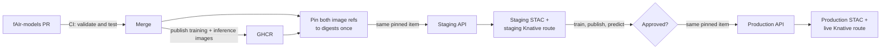

# Infrastructure and deployment

HOT's standard deployment process for other apps is documented in the [DevOps deployment guide](https://docs.hotosm.org/devops/deployment-process). fAIr differs slightly, because it has:

- Versioning of both software, as well as AI models.
- A dedicated dev instance EC2 for easier development with all components.

Currently model development happens in the `fAIr-models` repo, but this
might eventually move to the `fAIr` monorepo.

The model flow works like this:

- Each model dir has a `stac-item.json`. During development it may point at
  moving image tags; a release copy is pinned to digests before registration.
- A CI matrix workflow builds an image for each dir under `./models` when its
  contents change. Merges publish `v<version>` and `latest` training images,
  plus the matching `-inference` tags.
- An admin runs `fair basemodel pin` once, then submits the same pinned item to
  staging and production through `POST /api/v1/base-models/`.
- Registration mirrors weights into a versioned artifact path, publishes an
  integer STAC version, and updates the model's single Knative service. Staging
  gets a tagged route; production moves the live route only after the revision
  is Ready, including its `/health` readiness probe.
- A `BaseModel` table holds the model name and its status. The version details
  live entirely in each environment's STAC catalog.
- A scheduled reconciler restores Knative services from active STAC items.
  Destructive pruning remains disabled until STAC listing is paginated.

The backend image bundles `models/` from the same `fAIr-models` release as its
`fair-py-ops` dependency. Registration rejects a pipeline module that is not in
that bundle, so pipeline-code changes require a backend release; metadata,
weights, and inference-image-only changes do not.

## Step 1: Development

!!! note "The environment"

    - Single EC2, lightweight k3s cluster.
    - Manually updated and synced with dev.
    - Model registration in STAC is all manual.

1. Users work on models in development using the `dev` and `dev-inference`
   images built for the pull request.
2. Development model images (training and inference) are pushed to GHCR.
3. On the dev EC2 they run a script to update the **dev** STAC
   and knative records.
4. Any changes to the frontend / API are manually synced to
   the dev EC2 instance.
5. The dev model can be tested on the dev instance, using the
   dev STAC, ZenML, knative services.

## Step 2: Staging

!!! note "The environment"

    - Runs all the same components as production, but starts up via a PR from
      `staging` to `main`.
    - The components run inside the `fair-staging` namespace of the Kubernetes
      cluster, under domain `https://stage.ai.hotosm.org`.
    - Does not run its own `knative` controller, instead using the cluster-wide
      instance.

1. When we want to stabilise and push out a **new model**, or **updates to the
   API / website**, we use the staging setup.
2. First a PR must be raised on the fAIr repo from `staging` --> `main`.
   This will set up `https://stage.ai.hotosm.org` with ZenML / STAC /
   Knative registration.
3. The **staging** STAC is separate from production and persists between PRs.
4. After merge, pin both image references in a copy of the STAC item with
   `fair basemodel pin`. Register that file through the staging API. It is
   served at `https://staging-<model>.predict.ai.hotosm.org` without changing
   production traffic. Then test training, publishing, and prediction.
5. Once it looks good, register the model in production (Step 3) before merging
   the PR to `main`. Merging shuts the staging env down.

## Step 3: Production

!!! note "The environment"

    - Runs through tagged releases on GitHub, where ArgoCD picks up the latest
      Helm chart tag and deploys.

1. A new tagged version is made from the latest `main` code.
2. This triggers a redeploy of the fAIr website / API.
3. Register the exact pinned STAC item tested in staging through the production
   API. This publishes the next integer STAC version and moves live traffic to
   the Ready revision. The images are already in GHCR.
