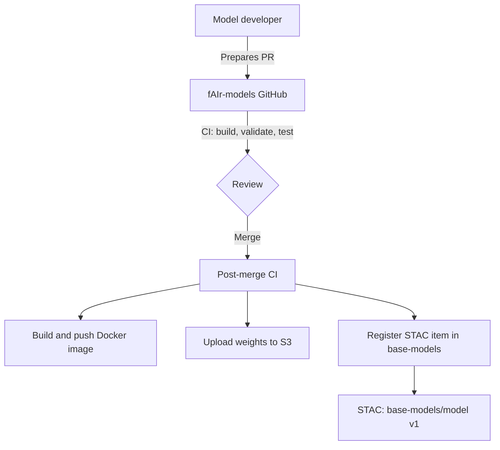
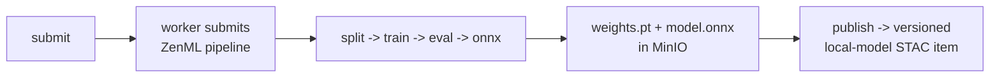
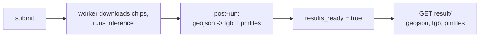

# ML pipeline

The backend never trains or runs inference inline. It submits pipelines to ZenML and polls their state. The choice of ZenML as the orchestrator is recorded in the [MLOps decision record](decisions/infra/0001-mlops.md). The services behind the pipeline (STAC, MinIO, MLflow, and ZenML) and their roles are listed in the [Architecture overview](index.md#components).

## Deployment architecture

These services run together on a Kubernetes setup. The fAIr backend submits jobs to ZenML, which trains on autoscaling GPU nodes and serves ONNX inference through Knative, with STAC as the source of truth for dataset and model metadata, S3 for artifacts, MLflow for experiment tracking, and Postgres for state. How HOT runs this on open source over AWS is described in the AWS Public Sector post [How HOT uses open source on AWS to power humanitarian AI](https://aws.amazon.com/blogs/publicsector/how-hot-uses-open-source-on-aws-to-power-humanitarian-ai/).

## Contribute and register a model

A model developer contributes through the [fAIr-models catalog](https://hotosm.github.io/fAIr-models/): they open a pull request, and after review and merge, the model's image is built, its weights are uploaded to object storage, and a STAC item is registered in the `base-models` collection. The backend then serves the approved model.

Inside fAIr, registration is admin-only and asynchronous: the backend hands the STAC item to fair-py-ops, which mirrors the model weights into the artifact store, deploys the inference service on the Knative and Kubernetes setup, stamps the category into `fair:category`, and marks the model active. The step-by-step API flow is in [Register a base model](../guides/register-a-base-model.md).

!!! note "Local compose has no Knative"

    The inference-service deployment applies to the production Kubernetes setup. A local `docker compose` stack has no Knative, so that step is skipped.

The contribution diagram is adapted from the [fAIr-models architecture docs](https://hotosm.github.io/fAIr-models/architecture/).

## Training

`POST /trainings/submit/` returns `202` with a row whose `zenml_run_id` is null. A worker submits a ZenML pipeline that runs `split`, `train`, `eval`, and `onnx`, and polls status into the database. The run produces `weights.pt` and `model.onnx` in MinIO.

`POST /trainings/{id}/publish/` is the only step that writes a versioned `local-models/` STAC item. It validates the logged `mlm:hyperparameters` against the base model's `fair:hyperparameters_spec`.

## Prediction

`POST /predictions/submit/` enqueues inference. A worker downloads chips for the requested bbox, submits an inference pipeline, and a post-run step turns the GeoJSON into `.fgb` and `.pmtiles`. Only then is `results_ready` set, and `GET /predictions/{id}/result/` returns three presigned URLs.

