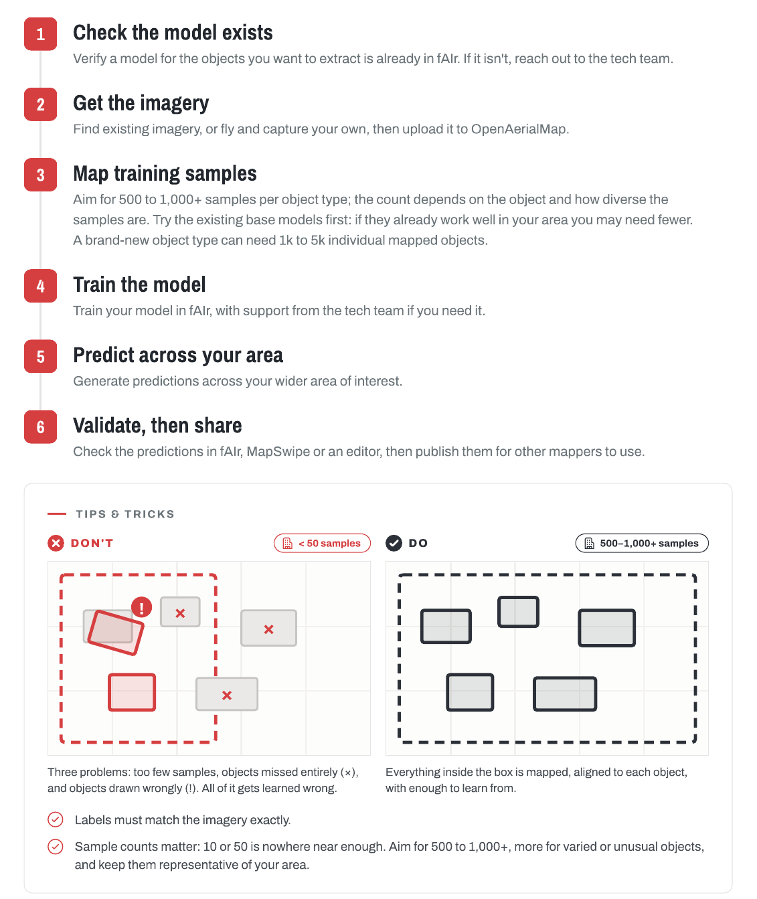

# Using fAIr

This manual is a step-by-step guide to getting started with fAIr, aimed at mappers and community project managers.

!!! note "Step-by-step guide coming"

    A UI/UX refactor is ongoing. Step-by-step instructions and screenshots for the new interface will be added here once it lands. To try fAIr now, visit [ai.hotosm.org](https://ai.hotosm.org/).

<!-- TODO: add the step-by-step walkthrough (create dataset, train, predict, validate) from the new UI once the refactor lands -->

## Prerequisites

- Stable Internet connection
- Knowledge on mapping . If you are new to mapping we suggest you to read [this](https://tasks.hotosm.org/learn/map) .
- Very basic knowledge on training AI Datasets and Models.
- Account on [fAIr](https://ai.hotosm.org/) .

## Help and Support

If you encounter any issues or need assistance while using fAIr, you can access the following resources:

- Check the [FAQs](../overview/faq.md).
- Ask the team on Slack: find **#fair-coord** at [slack.hotosm.org](https://slack.hotosm.org/).
