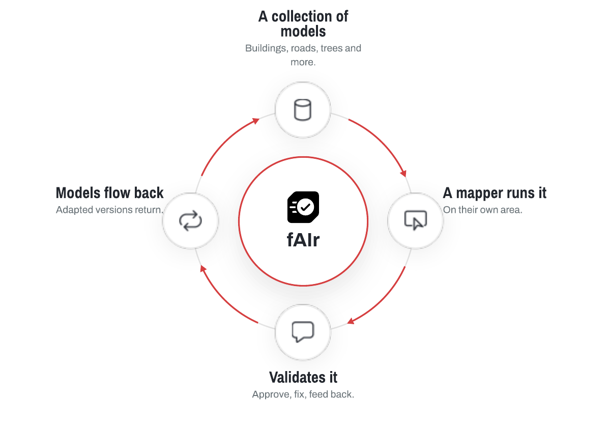

# fAIr

fAIr is an open, AI-assisted mapping service for humanitarian and development work, from the Humanitarian OpenStreetMap Team (HOT). It is a marketplace and connector for geo-AI models: a mapper picks a model, runs it over their own area to detect features such as buildings or trees, reviews the results, and can adapt the model to local conditions. A mapper stays in control at each step.

The software is free and open source. Predictions are suggestions for a mapper to review, and a mapper chooses what to add to OpenStreetMap.

[:lucide-download: &nbsp; Download the fAIr explainer (PDF)](assets/downloads/fair-explainer.pdf){ .md-button download }

## Where fAIr is today

fAIr has grown into an open collection of community-validated models, and is being connected with [MapSwipe](https://mapswipe.org/) for training and validation. See [Vision](overview/where-fair-is-going.md) for adoption and the direction ahead.

## Who it is for

- :lucide-mouse-pointer-click: &nbsp; **Mapper**

  ***

  Picks a model and runs it on their own area, then validates the results.

  [:lucide-arrow-right: Learn more](overview/who-uses-it.md#mapper)

- :lucide-square-pen: &nbsp; **Advanced user**

  ***

  Retrains a model for their area and publishes the local version.

  [:lucide-arrow-right: Learn more](overview/who-uses-it.md#advanced-user)

- :lucide-box: &nbsp; **Developer**

  ***

  Writes new geo-AI models and adds them to fAIr for others to use.

  [:lucide-arrow-right: Learn more](overview/who-uses-it.md#developer)

## Start here

- :lucide-help-circle: &nbsp; **What is fAIr**

  ***

  What it is and why it exists.

  [:lucide-arrow-right: Open](overview/what-is-fair.md)

- :lucide-workflow: &nbsp; **How it works**

  ***

  The model loop and the data pipeline.

  [:lucide-arrow-right: Open](overview/how-it-works.md)

- :lucide-boxes: &nbsp; **Models**

  ***

  What fAIr can map, and the open model catalog.

  [:lucide-arrow-right: Open](overview/models.md)

- :lucide-book-open: &nbsp; **Using fAIr**

  ***

  Step-by-step guide to run a model and validate the results.

  [:lucide-arrow-right: Open](guides/using-fair.md)

- :lucide-terminal: &nbsp; **Developer setup**

  ***

  Run the full stack locally and start iterating.

  [:lucide-arrow-right: Open](guides/developer-setup.md)

- :lucide-database: &nbsp; **Datasets**

  ***

  Published training and prediction data.

  [:lucide-arrow-right: Open](datasets/index.md)

- :lucide-map: &nbsp; **Roadmap**

  ***

  History and what is planned next.

  [:lucide-arrow-right: Open](roadmap/index.md)

