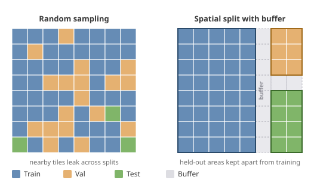
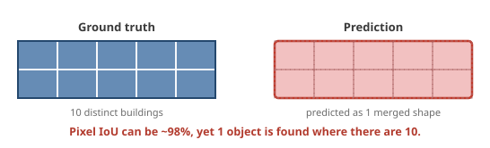

# Model evaluation and accuracy

A common question is: what is the accuracy of a fAIr model, and how is it measured? There is no single universal number. The right metric depends on the task, and every model states the metrics it reports in its model card (`README.md`) and in its STAC item. This page explains the approach and shows how it looks for a real model.

## Metrics depend on the task

Different tasks call for different metrics:

| Task type                              | Recommended metric                                                               |
| -------------------------------------- | -------------------------------------------------------------------------------- |
| Classification (binary or multi-class) | Precision, recall, and F1; overall accuracy for a balanced binary case           |
| Segmentation                           | Pixel IoU, and object-level IoU when the output is traces; per-class F1          |
| Object detection and instance tasks    | Object-level precision, recall, and F1 at an IoU threshold, and object-level IoU |

Per-class F1 is a common metric for both classification and segmentation (in segmentation, per-class F1 is the Dice coefficient), so it is a reasonable default to report alongside the task-specific metrics.

Two levels of measurement are used, for two audiences:

- **Object-level metrics** are recommended for end users, because they reflect what a mapper actually sees on the map: how many buildings were found, how many were correct, and how well each one lines up.
- **Pixel-level metrics** are used for internal model evaluation, where per-pixel overlap is a useful signal during development.

Object-level (polygon) metrics in fAIr are computed with the open-source [polymetrics](https://github.com/kshitijrajsharma/polymetrics) library.

## Beyond scientific metrics

Numbers are not the only signal. A mapper can run a model on their own area and judge the result visually, and can give the model a like or vote if it works well for them. This community assessment sits alongside the scientific metrics, so a model is evaluated both by its numbers and by the people who use it.

## Metrics are defined per model

A model can report the metrics that fit it, as long as they are clearly defined in two places:

1. The **model card** (`README.md`), which should also state the model's advantages and limitations.
2. The **STAC item**, in the `fair:metrics_spec` field, so the definitions travel with the model and are discoverable.

## Recommendations for model developers

A few practices keep a metric meaningful. They are guidance rather than rules, and the right choice can depend on the task.

**Split data spatially.** Image tiles next to each other are highly correlated, so a random train, validation, and test split lets neighbouring tiles leak across the boundary and inflates the reported accuracy. A spatial split keeps whole areas together, ideally separated by a buffer, and a held-out test set reserved for the final numbers keeps the accuracy representative of unseen areas. The right balance can vary by use case.



The buildings model below uses a spatial block split (whole tile blocks assigned to train or val). The buffer and a separate test set shown here are additional safeguards, applied per use case.

**Prefer per-class metrics when one class dominates.** In tasks where most pixels are background, such as building or road semantic segmentation, overall accuracy is misleading: a model that predicts "background" almost everywhere can still score high. Per-class metrics, for example building-class IoU, precision, and recall, reflect how well the feature of interest is actually found.

**Use object-level metrics for map-data outputs.** When a model produces map-data traces, such as building footprints or road segments, measure it at the object level: instance precision, recall, and F1 at an IoU threshold, object-level IoU, and polygon shape metrics, reported alongside pixel IoU. This reflects what ends up on the map, whether each feature is found and how well its geometry matches. Pixel overlap alone can look acceptable while individual features are merged, split, or missing.



Pixel IoU can sit near 98 percent while ten touching buildings are predicted as a single shape, so object-level metrics are the ones that catch the merge.

## Example: the buildings model

The `dinov3s-buildings` model declares its metrics in its STAC item. Each entry names a metric and defines how it is computed (descriptions abridged here):

```json
"fair:metrics_spec": [
  { "key": "fair:pixel_iou", "name": "Pixel IoU",
    "description": "Building-class pixel IoU on the val split: sum of intersection pixels divided by sum of union pixels across all val chips." },
  { "key": "fair:instance_precision", "name": "Instance Precision @ IoU>0.5",
    "description": "Fraction of predicted building instances that match a ground-truth instance at IoU>0.5 (panoptic-style matching)." },
  { "key": "fair:instance_recall", "name": "Instance Recall @ IoU>0.5",
    "description": "Fraction of ground-truth building instances matched by a prediction at IoU>0.5." },
  { "key": "fair:instance_f1", "name": "Instance F1 @ IoU>0.5",
    "description": "Harmonic mean of instance precision and recall, micro-averaged across the val split." },
  { "key": "fair:pred_avg_vertices", "name": "Predicted polygon avg vertices",
    "description": "Mean exterior vertex count across all predicted polygons." },
  { "key": "fair:pred_orthogonality", "name": "Predicted polygon orthogonality",
    "description": "Mean fraction of edges within 5 degrees of the dominant axis. 1.0 = rectangular, near 0 = jagged." }
]
```

The evaluation set is defined in the same item, so results are reproducible:

```json
"fair:split_spec": {
  "strategy": "spatial", "seed": 42, "block_size": 4, "default_ratio": 0.2,
  "description": "Spatial block split on tile coordinates: whole blocks of chips assigned to train or val, so nearby chips do not leak across the split."
}
```

The model card reports the numbers. On a Banepa, Nepal scene (2,720 OSM ground-truth buildings), the buildings model was measured two ways: the **global model** (fAIr's base model) run zero-shot with no local training, and a **local model** fine-tuned on a sample of Banepa's own chips. The fine-tuned figures show performance within Banepa itself, where the model was tuned.

| Metric                       | Level  | Global model | Local model |
| ---------------------------- | ------ | ------------ | ----------- |
| Pixel IoU                    | pixel  | 0.495        | 0.604       |
| Instance precision @ IoU>0.5 | object | 0.354        | 0.394       |
| Instance recall @ IoU>0.5    | object | 0.261        | 0.295       |
| Instance F1 @ IoU>0.5        | object | 0.300        | 0.337       |
| Mean IoU (matched)           | object | 0.677        | 0.690       |

The full table, how each metric is defined, and the model's limitations are in the [model README](https://github.com/hotosm/fAIr-models/blob/develop/models/dinov3s_buildings/README.md).

## Summary

- The metric is chosen to fit the task, and is defined in the model card and STAC item.
- Data is split spatially, and object-level metrics are used for map-data outputs.
- Community visual assessment complements the numbers.
