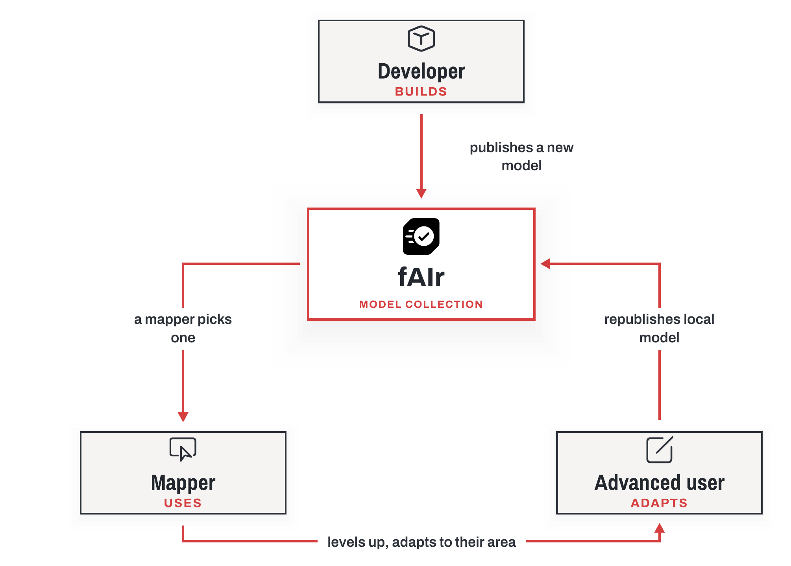
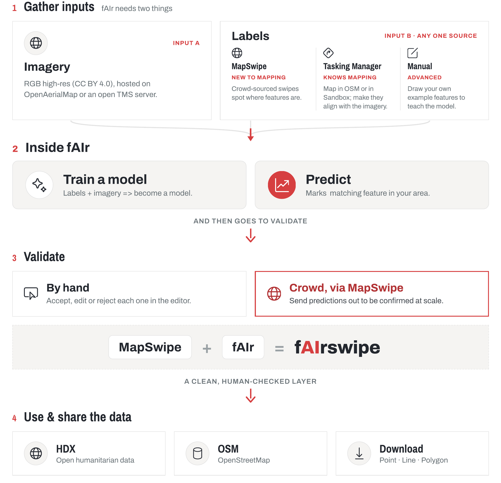

# How it works

fAIr has two connected cycles: a **model loop**, where models are shared, run, and improved, and a **data pipeline**, where imagery and labels become predictions that people validate and reuse.

## The model loop

A model starts in the shared collection. A mapper runs it over their own area and reviews the output. When someone retrains a model for a specific area, the local version is published back to the collection, so the next mapper can start from it.

The loop has four steps:

1. A **collection of models** is shared with everyone.
2. A **mapper runs** a model on their own area.
3. They **validate** the results: approve, fix, and feed back.
4. Improved or locally adapted **models flow back** to the collection.

The three roles that meet fAIr at this loop are described in [Who uses it](who-uses-it.md).

## The data pipeline

A model is only as good as the examples it learns from. fAIr takes labels and imagery, produces predictions, lets people validate them, and returns clean results.

### 1. Inputs

fAIr needs two things:

- **Imagery.** High-resolution RGB imagery (CC BY 4.0) from [OpenAerialMap](https://openaerialmap.org/) or an open TMS source (a tiled imagery server).
- **Labels.** Examples that teach the model what to find. They come from three sources, matched to a mapper's experience: quick swipes in [MapSwipe](https://mapswipe.org/) for those new to mapping, tracing in HOT's [Tasking Manager](https://tasks.hotosm.org/) for experienced mappers, or features drawn by hand for advanced users. Crowdsourced swiping via MapSwipe also creates training data through fAIrSwipe; see [Field projects](../progress/field-projects.md).

### 2. Inside fAIr

Labels and imagery are used to train a model. A trained model then predicts matching features across a chosen area and returns them as GeoJSON, a common open format for map features.

### 3. Validate

Predictions are reviewed before they are used. A mapper can give feedback in the editor by accepting or rejecting each prediction, verify them on the ground with the Field Mapping Tasking Manager (FMTM, with QField) or Chatmap, or confirm them at scale through [MapSwipe](https://mapswipe.org/). Validating predictions by swiping is the Validate project of fAIrSwipe (fAIr plus MapSwipe), shown in the pipeline above.

### 4. Use and share

Validated data can be published to the [Humanitarian Data Exchange](https://data.humdata.org/), manually added to OpenStreetMap by an expert mapper, or downloaded as points, lines, or polygons. See [Datasets](../datasets/index.md) for the published outputs.

!!! note "OSM merges stay manual"

    fAIr does not push data into OpenStreetMap automatically. A mapper reviews predictions and decides what to add.
