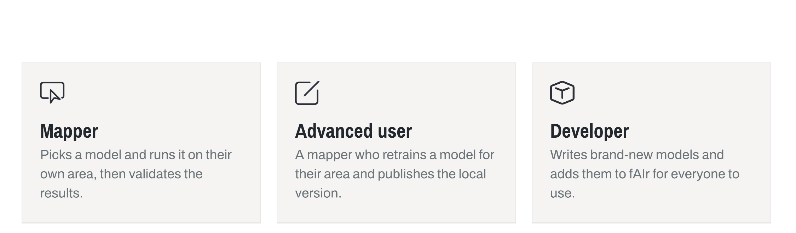
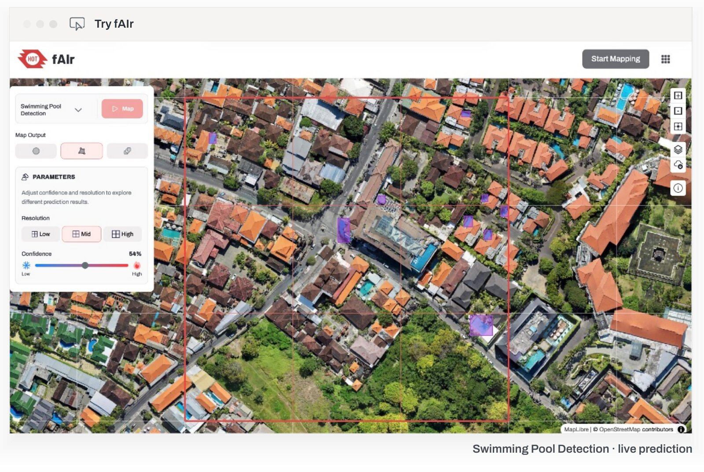
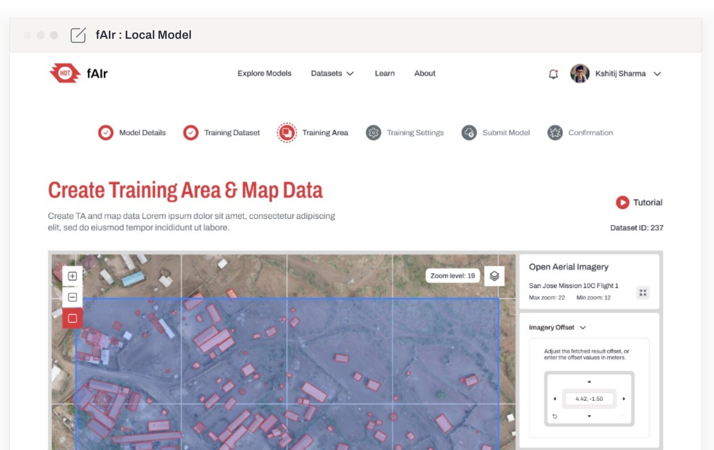

# Who uses it

People meet fAIr at three levels. Each one draws from the same model collection and feeds something back, so the work keeps improving.

## Mapper

_"There is a model out there. Let me see how it works in my area."_

A mapper runs an existing model and reviews what it finds.

1. **Sees a model.** Browses the collection for one that fits: buildings, trees, swimming pools, solid waste, and more.
2. **Runs it.** Points the model at their own area and lets it detect features.
3. **Gets results.** Predictions come back as GeoJSON, ready for the map.
4. **Validates.** Checks each result. Feedback improves the model.

Validation can happen by hand, in the field, or at scale; see [How it works](how-it-works.md#3-validate).

Do not see a model for the feature you want? Ask the team in **#fair-coord** on [Slack](https://slack.hotosm.org/).

## Advanced user

_"This is good, but tuned to my area it would work better."_

An advanced user is a mapper who retrains a model for their own area and publishes the local version.

1. **Picks a model.** Starts from one already in the collection.
2. **Creates a training area.** Sets up an area and maps example features there.
3. **Maps it and retrains.** Feeds the local examples back into the model.
4. **Publishes.** The tuned local version returns to the collection for the next mapper.

The full step-by-step is in [Using fAIr](../guides/using-fair.md), and [Register a base model](../guides/register-a-base-model.md) covers publishing.

## Developer

_"I built a model that maps a new feature. I want to share it."_

A developer writes a new geo-AI model and adds it to fAIr.

1. **Writes the model.** Builds and trains a new model, for example one that maps a feature not yet covered.
2. **Adds it to fAIr.** Publishes the model to the collection with a clear name and the features it detects.
3. **Available to everyone.** From that point, any mapper or advanced user can run it.

Models are contributed through a pull request to the [fAIr-models catalog](https://hotosm.github.io/fAIr-models/); see [Models](models.md#contributing-a-model) for what to contribute and [ML pipeline](../architecture/ml-pipeline.md) for how registration works.
