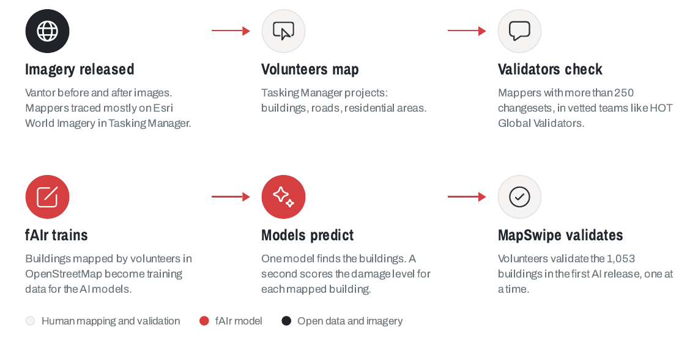

# Activations

When a disaster hits, fAIr is used for rapid response: local models are trained on imagery mapped during the activation, then used to speed up feature and damage mapping while volunteers validate the results. This page tracks fAIr disaster activations.

## Nepal floods 2026

In August 2026, flash floods and mudslides swept down the Lhende Khola valley into the Bhote Koshi in Rasuwa district. Within 24 hours of the flood, HOT, NAXA and NDRRMA opened the first mapping project. Volunteers mapped from Vantor before-and-after imagery, and two fAIr local models learned from that mapping: one found the buildings, the other scored the damage level per building. Volunteers then validated the AI results.

- **338** experienced volunteer mappers, **799** MapSwipe validators, **20,100** buildings added to OpenStreetMap.
- Two local models trained on buildings mapped by hand during the response, live on [Try fAIr](https://dev.ai.hotosm.org/try-fair).
- Open data on HDX: [flood-affected buildings](https://data.humdata.org/dataset/hot_flood_npl), the [river corridor](https://data.humdata.org/dataset/hot_flood_npl_corridor), and the [fAIr damage assessment](https://data.humdata.org/dataset/hot_flood_npl_buildings_damage).

[:lucide-download: &nbsp; Download the Nepal floods workflow (PDF)](../assets/downloads/nepal-flood-workflow.pdf){ .md-button download }

## Venezuela earthquake 2026

On 24 June 2026, two earthquakes struck northern Venezuela seconds apart, a magnitude 7.5 shock following a 7.2 foreshock, damaging buildings across Caracas, La Guaira, and the coastal Vargas area. Within 24 hours, fAIr delivered building density, AI-detected building footprints, and building-damage predictions from post-event Vantor imagery to early responders. Volunteers then mapped buildings in OpenStreetMap and validated the damage predictions through MapSwipe.

- **590** contributors mapped around **97,000** building footprints, part of **136,000** OpenStreetMap edits during the response.
- More than **600** MapSwipe volunteers validated the building-damage predictions from fAIr and Microsoft's AI for Good Lab, producing human-validated damage assessments for Caraballeda, La Guaira, and Caracas.
- Validate the results on the [MapSwipe project](https://mapswipe.org/en/projects/01KWF5JAVNZG7BY0AJ7WVM22T7/).
- Open data on HDX: [building footprints](https://data.humdata.org/dataset/hot_eq_ven) and the [building-damage assessment](https://data.humdata.org/dataset/venezuela-m-7-5-earthquake-building-damage-assessment).
