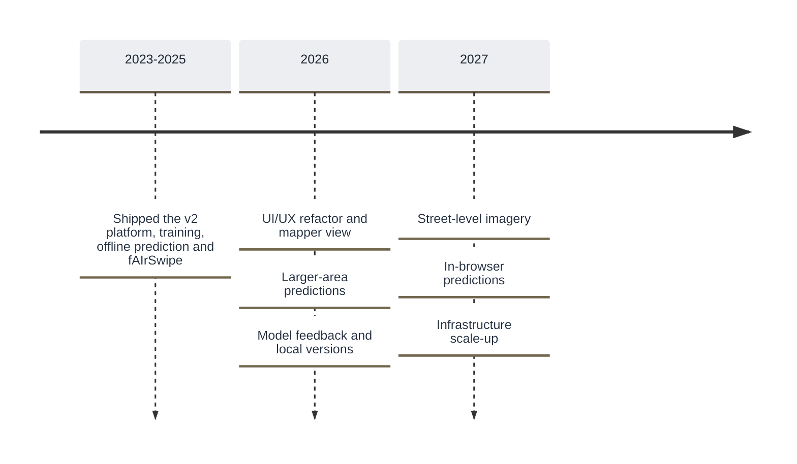

# Roadmap

Where fAIr came from, what has shipped, and what is being worked on. For the bigger picture and how fAIr is positioned, see [Vision](../overview/where-fair-is-going.md).

## Timeline

Current figures for each effort are tracked on the [Milestones](../progress/milestones.md) page.

## Now and later

Planned for 2026, targeted for the end of the year.

- :lucide-circle-dot: &nbsp; **Now**

  ***
  - A UI/UX refactor is underway
  - Mapper view: pick any model, apply it to any imagery, and see the results
  - Prediction requests over larger areas
  - Targeted for the end of September 2026

- :lucide-circle-dashed: &nbsp; **Later**

  ***
  - Feedback on model results
  - Improving a model with more training data to create a local version
  - Rating a model
  - Targeted for the end of 2026

## Exploring next year

Options under exploration for 2027.

- Street-level imagery
- Scaling up the infrastructure and stabilizing the server
- Simplifying the user base
- In-browser predictions
- Public STAC endpoints released with the training datasets

!!! note "This roadmap is a living summary"

    It is maintained in Markdown so it is quick to update. Item order and grouping are indicative. The live board is at [hotosm/projects/40](https://github.com/orgs/hotosm/projects/40).

## Shipped

Capabilities already released, with the release series in which each landed.

| Capability                                                   | Release  |
| ------------------------------------------------------------ | -------- |
| Adopting the YOLOv8 model                                    | v2.0.1+  |
| Redesigned interface                                         | v2.0.10+ |
| User profiles and activity                                   | v2.1.0   |
| Notifications on training status                             | v2.1.3   |
| Replicable models (run a model on new imagery or a new area) | v2.2.0   |
| Offline AI prediction                                        | v2.2.3   |
| Post-processing of predicted geometry                        | v2.2.4   |
| fAIrSwipe (validate predictions via MapSwipe)                | v2.2.15  |

The current release series is v2.2.x.
