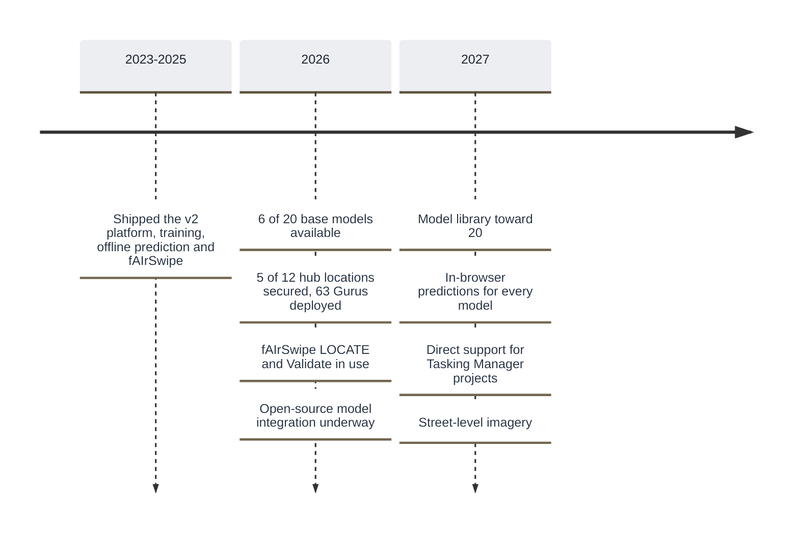

# Roadmap

Where fAIr came from, what has shipped, and what is being worked on. For the bigger picture and how fAIr is positioned, see [Where fAIr is going](../overview/where-fair-is-going.md).

## Timeline

## Now, next, later

- :lucide-circle-dot: &nbsp; **Now**

  ***
  - fAIrSwipe (fAIr plus MapSwipe): LOCATE for training data and Validate for checking predictions
  - Open Mapping Gurus releasing open training datasets
  - Integrating open-source geo-AI models into fAIr
  - Private and public models and datasets

- :lucide-arrow-right-circle: &nbsp; **Next**

  ***
  - A public list of prediction requests and results
  - Wider feature coverage: roads and highways, solar panels, seagrass

- :lucide-circle-dashed: &nbsp; **Later**

  ***
  - In-browser predictions for every model
  - Direct support for Tasking Manager projects (licensed imagery, validated tasks)
  - Street-level imagery
  - Cloning a model with its dataset to develop it further
  - Discussion and feedback on public models

!!! note "This roadmap is a living summary"

    It is maintained in Markdown so it is quick to update. Item order and grouping are indicative. The live board is at [hotosm/projects/40](https://github.com/orgs/hotosm/projects/40).

## Shipped

Capabilities already released, with the release series in which each landed.

| Capability                                                   | Release  |
| ------------------------------------------------------------ | -------- |
| Adopting the YOLOv8 model                                    | v2.0.1+  |
| Redesigned interface                                         | v2.0.10+ |
| User profiles and activity                                   | v2.1.0   |
| Notifications on training status                             | v2.1.3   |
| Replicable models (run a model on new imagery or a new area) | v2.2.0   |
| Offline AI prediction                                        | v2.2.3   |
| Post-processing of predicted geometry                        | v2.2.4   |
| fAIrSwipe (validate predictions via MapSwipe)                | v2.2.15  |

The current release series is v2.2.x.
